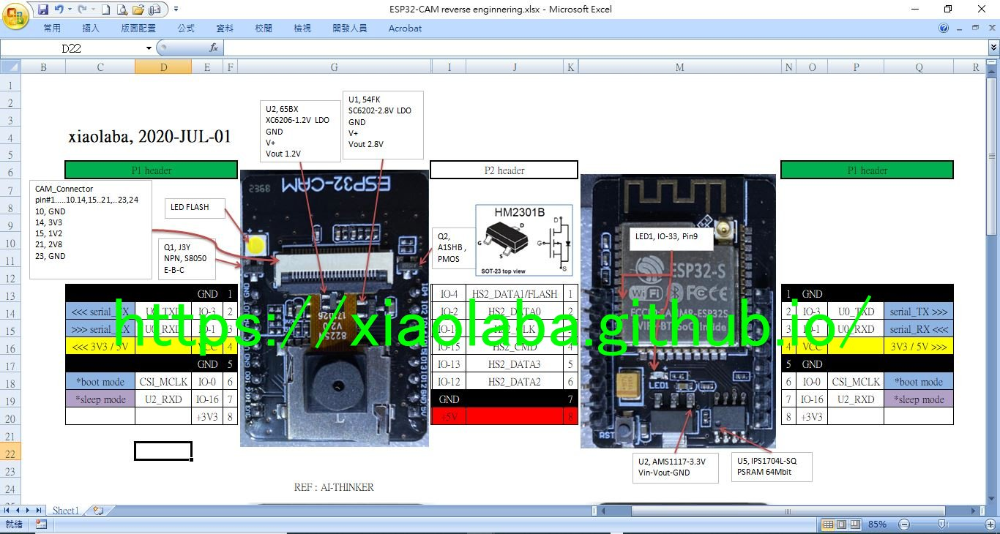
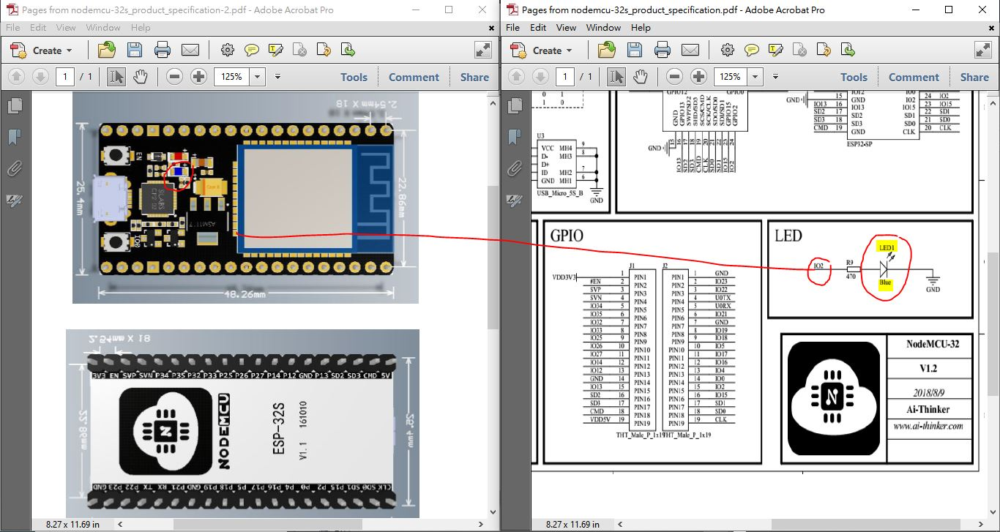
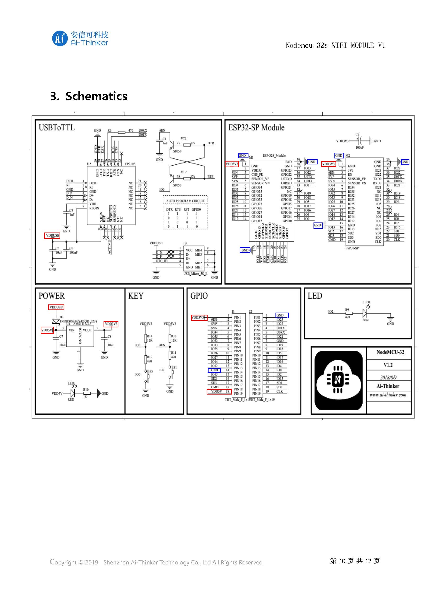

# ESP32-CAM_blink
ESP32-CAM, blinking both led1 and Flash_LED  
5 fast blinking, 2 slow blinking, repeating, click image below to see video and effect,

source code is here   
firmware for chip burning, 


https://www.youtube.com/watch?v=--tuzdXo720  
[](https://www.youtube.com/watch?v=--tuzdXo720)


ref: how to embedding youtube with github page,  
```  
[](https://www.youtube.com/watch?v= VIDEO_ID )
```  
  
  
schematic, clone from AI-Thinker, http://wiki.ai-thinker.com/esp32-cam
  
.  
.  
.  
PCB & component placement, by reversed engineering,  
  


extra test for camera in action, no code available, click image below to see video and result,  
https://www.youtube.com/watch?v=CalkROL9-4w  
 


### 2021-FEB-27, test different hardward, NodeMCU-32S, metal can printed ESP-WROOM-32 (or a clone ??), no PSRAM. LED1 connected to IO2.  
  

schematic, [nodemcu-32s_product_specification.pdf](nodemcu-32s_product_specification.pdf)  



